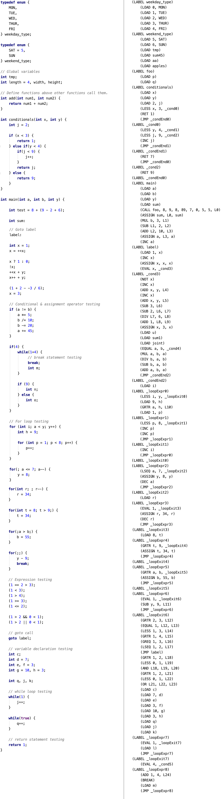

re-declaredBeginning# Design Choices and Process
The team chose Java as the language of choice for our compiler. The main reasoning behind this is that each of us has a familiarity with the language, easy I/O implementation, data structures, and (ultimately) garbage collection.

### Documentation Table of Contents:
* [Program Overview and Usage](../README.md)
* [Design Discussion, Limitations, and Tradeoffs](design_spec.md)  (here)
* [Language Specifications](language_spec.md)

## Assignment 1 *(Front End)*
A more in-depth explanation of how the implementation details of each section of the compiler.

### Stage 0: Command Line Interface
Because Java does not have a built-in method of managing command line arguments, a library was chosen to handle this user-facing part of the compiler. Rather than hand-roll it ourselves the option of using a library that is well tested and less error prone seemed appropriate. The library chosen was the [Apache Commons CLI](http://commons.apache.org/proper/commons-cli/) library, mainly due to the fact that it requires no other dependencies.

See [here](../README.md#usage) for details on supported arguments.

### Stage 1: Scanner
The scanner reads the file into a String Array, matching the beginning of the line against an ordered set of regular expressions mapped with corresponding token type (enumeration). If a match is found, the token is added to a structure and stored, with the line being truncated from the front of the string. If a token is not matched, the program errors with the corresponding line number and character which caused the error. The precedence order of the token regular expression and enumeration does matter in some cases, with tokens like `<=` or `>=` occurring before `=`.

Although maybe not entirely efficient, being able to keep track of the line number was a feature we chose to retain for this initial part of the compiler.

See [here](language_spec.md#supported-tokens) for supported tokens.

### Stage 2.A: Parser
We decided that the parser, designed with a top-down recursive approach made practical sense for ease of implementation and understanding. Designating a method for the processing of each major section of the grammar (Program, Declarations, Statements, and Expressions), we built our parse tree using an abstract class node, which allows us to process and print the tree in either a general or specific manner depending on our requirement.

Utilizing the Pratt Parsing approach, we provide the a precedence to tokens when processing an expression. A `Left Denotative` and `Null Denotative` consideration is given to each relevant token, handling through delegate classes through Java anonymous functions (no function pointers here) for handling the processing.

See [here](https://books.google.com/books?id=gJrmszNHQV4C&lpg=PA134&ots=rNW-wxV7lg&dq=null%20denotative%20vs%20left%20denotative&pg=PA134#v=onepage&q=null%20denotative%20vs%20left%20denotative&f=false) for more information on the Pratt Parser structure.

The parser uses a visitor pattern for printing by allowing us to traverse the parse tree generically. This visitor pattern is again utilized in the IRBuilder classes for Assignment 2.

See below for functionality and limitations.


See [here](language_spec.md#program) for an in-depth look at our grammar.

## Assignment 2 *(IR Generation)*
A more in-depth explanation of the implementation of the intermediate representation stages.

### Stage 2.B: Symbol Table
The symbol table involves a set of hash-maps with the unique variable name as a key, and the respective variable type serving as the value. The structure is built as a wrapper class with "pointers" to lower scoped symbol tables. With each block statement (encompassed in braces `{` and `}`), a new table is created as a child of the outer block's symbol table.

The symbol table logic includes functions that add a new table, add a new key/value pair to the current table, retrieve the size of one of the tables, error checks to make sure already declared variables in outer scopes are not re-declared in inner scopes.

### Stage 3: IR Generation

The compiler holds an enumerated class that keeps track of instructions that are x86 compliant. This is utilized when building an IR object (the first parameter of the IR object).

IR Expressions serve as the basis for our IR object creation. Most IR expressions can consist up to four parameters `INSTRUCTION`, `SOURCE1`, `SOURCE2`, `DESTINATION`, with the exception of the `CALL` instruction which can support up to 8 (our own restriction) source value for parameters. The different IR expressions can be represented in the following format:

```
(INSTRUCTION SOURCE1, SOURCE2, DESTINATION)

(INSTRUCTION SOURCE1, DESTINATION)

(INSTRUCTION DESTINATION)

(INSTRUCTION)
```

The instructions supported can be seen [here.](language_spec.md#intermediate-representation-instructions)

The IR expressions are made using the IRBuilder class, which utilizes the visitor pattern to traverse the parse tree in a similar fashion to how the parse tree is printed. Each node type has an associated method which creates an IR expression from the IR expression class and then adds it to the linear IR expression list (described below). Most expression nodes return the temporary variable of where the expression previously had been evaluated into.

The IRList class behaves as a wrapper class that keeps track of every IR expression object created in addition to generating new labels when necessary. It keeps track of an ArrayList which represents our IR in a linear fashion which will be also help optimize the IRList in the next stage.

Below is an example of some nonsensical code with our equivalent intermediate representation. The IR is almost assembly like in form.



## Assignment 3 *(Assembly Generation)*
A more in-depth description of our assembly generation and optimization mechanics.

### Stage 4: Optimization

> When compiling with -00

Our minor compilation optimization is reducing register shuffling. Our compiler uses a round-robin allocation method and mutex style locking mechanism to handle register assignment. Our IR is iterated through and all references of a variable is added to a hash-map with a reference counter. If the reference is not zero, there is probably a lock on the register meaning it is used in the next instruction or later on and the register should not be made available to the next variable we need to populate. This can cause issues when we add a variable to a specific register for function calls (x86-64 calling convention). When a specific register is requested but contains a lock, the variable is moved to the next available register. It is possible that the next available register in the list is the next one to be used for a function call parameter. If this is the case, the register keeps shuffling through all the parameter call registers till it sits in the next free register, causing unnecessary `mov` instructions. We can adjust the index for which the round-robin begins at, to mitigate the unnecessary movements between registers.

> When compiling with -01

The optimization of our IR is handled using constant folding and constant propagation methods. Each time the intermediate representation is iterated through during constant propagation, the IR expression is determined whether or not the variable is modified in the expression. If the variable is modified, a lock is placed on the reference to prevent changing the variable when it should not be, and the constant propagation continues to replace all variables that do not have a lock with their corresponding constant.

After the propagation cycle is done, the constant folding procedure begins. For each IR expression instruction that contains constants used in math expressions, the math expression is processed, and if a lock is enabled on the constant being changed, the lock is removed to be handled in the next iteration of constant propagation. If an expression can be removed entirely but it's intermediate variable is still used, the IR expression is replaced with a `LOAD` expression so as to retain the required value in the code.

Each constant mechanism (folding & propagation) is applied to each function in our IR until no more changes have been made, and continues to the next function. All `LOAD` instructions that are meant to populate variables, which include variables that have been fully propagated and folded and are no longer needed are removed, reducing the instruction count substantially.

### Stage 5: Assembly Generator
When generating assembly we manage registers with a round-robin approach in addition to a memory stack manager, both using a mutex style lock. Our approach to ensuring registers were being allocated correctly was to implement a mutex-lock mechanism. Every register and memory location has a boolean flag assigned to signal if it was in use or free. It then searched for a new open register that had its flag open. Next, store what needed to populate the next available register. After the register was populated, we would signal the register was locked so that the next call to this method that requires a register would acknowledge this register is occupied.

The assembly was generated based on the intermediate representation instruction [(see here here for instructions)](language_spec.md#intermediate-representation-instructions). Functions begin, creating a reference count of variables used, and declared (data taken from out symbol table record). Declared variables were used to calculate the size of the stack, and used to create the stack offset (ie. `subq $16, %rsp`), with an alignment to 16 bytes. All instructions that require a variable grab the the location of where a variable is stored (in memory or in a register), and reduce the variable reference count, possibly unlocking the location for future use. [See here for assembly instructions used.](language_spec.md#assembly-instruction-set)

Each code scope has it's own corresponding reference count, so when a new code scope is being converted to assembly, a reference counter is placed on a stack. This allows us to reuse function declarations in memory, and keep track of memory usage relative to the scope.

# Supported Features

While we do support the following features, we have only done so much testing and may not have come across every edge case instances or scenarios.

Therefore, the following is supported by our compiler with *possible* limitations:
* Identifiers, variables, functions & function calls (limited to 4 parameters)
* While-loops and for-loops
* Nested for-loops, nested while-loops, and nested conditionals
* Goto(s) and labels
* Arithmetic expressions (+, -, \*, /)
* Assignment
* Boolean expressions
* Goto statements
* if, else-if, else control flow
* Increment operators (++, --) **if used as PRE-INC/DEC ONLY** (ie. i++, and ++i has the same result)
* Assingment operators (+=, -=, /=, \*=)
* Unary operators (!)
* Return statements
* Break Statements
* While loops
* For loops

**Please refer back to the programs guaranteed to work.**

# Limitations
The compiler is built read in a `c` file, and an IR file containing a series of IR expressions ready to be converted to assembly in the next assignment.

Currently our compiler allows for the print out (to console) and write out (to file) of the tokens list, parse tree, symbol table, and IR expression list.

Please note that all restrictions we place on the `C-code` compiled by our program below, if noted in one assignment carries on through to the next assignment, and is not supported by later stages.
#### Assignment 1: Scanner & Parser

* **ALL BLOCK STATEMENTS REQUIRE BRACES: `{}`**
* Function calls are limited to 4 parameters
* Function prototypes are **NOT** supported
* The only supported return type is `int`
* Structures, pointers, strings, and arrays are **NOT** supported)
* The only supported variable type is `int`
* Braces are required for all blocks (even one line blocks)
* Imports and macros and any preprocessor related elements are **NOT** supported.
* Switch statements are **NOT** supported.
* Bitwise operators are **NOT** supported
* We do **NOT** support the `continue` keyword.
* All instances of pre-increment/decrement and post-Increment/decrement, are handled as pre-increment/decrement.
* Modulus operator is not supported

#### Assignment 2: IR Generation

* Enumeration (specifically typedef defined) are **NOT** supported
* Ternary conditionals are **NOT** supported beyond this point.
* Error handling messages (Line number errors might be off by 1 number in addition to the token corresponding to the error).

#### Assignment 3: x86 Assembly Generation Limitations

The following is are requirements of limitations of compiler as it stands:
* All functions require a return
* Function type checking is not handled
* Variable type checking is not handled
* The flag -O2 flag optimization is limited in functionality (works with minimal programs), and may causes errors, especially if used with loops and conditionals in the .c code.
* Function call parameter counts are not checked.
* Comparisons between constants are **NOT** supported (ie. (3 < 4)).

**IF NOT MENTIONED IN 'SUPPORTED FEATURES' SECTION IT IS NOT SUPPORTED.**

# The Future of JxC
The goal behind this project was to create a compiler based on the 'C-' Grammar for our capstone class at New Mexico Tech. We believe we accomplished exactly that (albeit the things mentioned above). With more time to design, expand and improve upon the project after graduation, here is a list of thigs we hope to accomplish:

* A complete overhaul and redesign of Assignment 3
    > The code now accomplish the tasks supported. However it can get really hard to keep track of certain references and functionality aspects of certain methods. An architectural design pattern or possibly restructure and introduction of classes to further spread out the construction of asm might provide more successful generation of asm for the future.

* More optimization routines
    > There were many topics on optimization that were covered in CSE 423. We would love to provide more theoretical practices about optimizations in our compiler to condense the asm generation we now handle (as of May 3, 2020).

* Security
    > We are aware of some security practices that modern compilers utilize and would like to implement this for the future JxC build.

* Error handling
    > We currently handle a limited scope of handling errors encountered. We would like to eventually be able to track errors and warnings that gcc or clang provide with a different degree of helpfulness.
